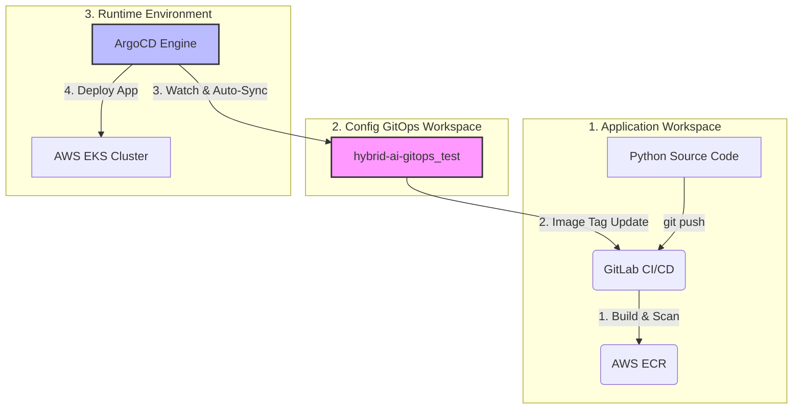

# 🚀 Hybrid AI GitOps Operation Platform (Test Sandbox)

본 저장소는 하이브리드 클라우드 환경에서 AI 및 GitOps 운영 플랫폼을 구축하기 위한 인프라 프로비저닝(IaC) 스크립트 및 쿠버네티스 배포 매니페스트(Manifest)를 관리하는 샌드박스 저장소입니다.

보안 및 무한 루프 방지를 위해 **애플리케이션 소스 코드(GitLab)**와 **인프라/배포 설정(GitHub)**을 분리하여 운영하는 정석적인 GitOps 아키텍처를 따릅니다.

---

## 🏗️ 시스템 아키텍처 및 흐름 (GitOps Workflow)



1. **개발자**가 GitLab에 파이썬 웹 코드를 푸시하면 파이썬 빌드 및 trivy 보안 스캔이 구동됩니다.
2. 빌드가 성공하면 이미지가 **AWS ECR**에 푸시되고, GitLab CI가 이 GitHub 저장소의 `manifest/deployment.yaml` 내 이미지 태그를 최신 커밋 SHA 값으로 자동 업데이트합니다.
3. EKS 내부에 띄워진 **ArgoCD**가 본 GitHub 저장소의 변경 사항을 감지하여 EKS 클러스터에 최종 배포(Auto-Sync)합니다.

---

## 📁 디렉토리 구조 (Directory Structure)

```text
hybrid-ai-gitops_test/
├── ansible_test/               # Ansible 기반의 EKS 및 ArgoCD 설정 자동화 파일
│   ├── eks-gitops-playbook.yaml # EKS 생성, Kubeconfig 설정, ArgoCD 배포 마스터 플레이북
│   └── eksctl-config.yaml.j2    # ClusterConfig 정의를 위한 Jinja2 템플릿
├── infra_test/                 # Pure Terraform 기반의 인프라 프로비저닝 파일
│   ├── main.tf                  # Provider 및 AWS 기본 설정
│   ├── vpc.tf                   # EKS 전용 VPC 및 Subnet/NAT 모듈 설정
│   ├── eks.tf                   # EKS Cluster 및 Managed Node Group 설정
│   ├── variables.tf             # 인프라 변수 정의 파일
│   └── outputs.tf               # 구축 후 출력값 (Cluster Endpoint 등)
└── manifest/                   # ArgoCD가 감시할 쿠버네티스 배포 매니페스트
    └── deployment.yaml         # Python 웹 애플리케이션 및 LoadBalancer 서비스 정의

```

---

## 🛠️ 사전 요구사항 (Prerequisites)

로컬 개발 환경(WSL / Ubuntu)에서 이 스크립트들을 실행하기 전에 아래 도구들이 반드시 설치되어 있어야 합니다.

### 1. 필수 CLI 도구 설치

```bash
# 1. AWS CLI 설치 및 자격증명 설정
curl "[https://awscli.amazonaws.com/awscli-exe-linux-x86_64.zip](https://awscli.amazonaws.com/awscli-exe-linux-x86_64.zip)" -o "awscliv2.zip"
unzip awscliv2.zip && sudo ./aws/install
aws configure # AWS Access Key, Secret Key 등록 필수

# 2. kubectl 설치 (Kubernetes 제어 도구)
curl -LO "[https://dl.k8s.io/release/$](https://dl.k8s.io/release/$)(curl -L -s [https://dl.k8s.io/release/stable.txt](https://dl.k8s.io/release/stable.txt))/bin/linux/amd64/kubectl"
sudo install -o root -g root -m 0755 kubectl /usr/local/bin/kubectl

```

### 2. 프로비저닝 방식별 추가 도구 설치

* **Terraform 방식 (`infra_test`) 사용 시**: [Terraform CLI 설치](https://developer.hashicorp.com/terraform/tutorials/aws-get-started/install-cli) 필요
* **Ansible 방식 (`ansible_test`) 사용 시**: Ansible 및 `eksctl` 설치 필요
```bash
# Ansible 설치
sudo apt update && sudo apt install -y ansible

# eksctl 설치 (AWS 공식 EKS 관리 도구)
curl --silent --location "[https://github.com/weaveworks/eksctl/releases/latest/download/eksctl_$](https://github.com/weaveworks/eksctl/releases/latest/download/eksctl_$)(uname -s)_amd64.tar.gz" | tar xz -C /tmp
sudo mv /tmp/eksctl /usr/local/bin

```


---

## 🚀 사용법 (Usage Guide)

인프라를 구축하는 방법은 두 가지가 준비되어 있으며, 선호하는 아키텍처 방식을 선택하여 수행합니다.

### Option A. Terraform으로 순수 인프라 구축 (`infra_test`)

선언적 코드로 클라우드 자원의 라이프사이클을 완벽히 제어하고 싶을 때 사용합니다.

```bash
cd infra_test/

# 1. 테라폼 초기화 및 모듈 다운로드
terraform init

# 2. 인프라 생성 계획 확인
terraform plan

# 3. AWS 인프라 실제 배포 (약 10~15분 소요)
terraform apply -auto-approve

# 4. 생성 완료 후 WSL의 kubectl과 EKS 클러스터 연결
aws eks update-kubeconfig --region ap-northeast-2 --name hybrid-gitops-eks

```

---

### Option B. Ansible + eksctl로 원클릭 자동 구축 (`ansible_test`)

인프라 생성뿐만 아니라 내부 패키지(ArgoCD) 설치 및 서비스 상태 설정까지 전 과정을 일괄 자동화할 때 사용합니다.

```bash
cd ansible_test/

# 앤시블 플레이북 실행 (EKS 구축 -> ArgoCD 설치 -> 로드밸런서 오픈까지 한 방에 진행)
ansible-playbook eks-gitops-playbook.yaml

```

* **플레이북 완료 후 출력되는 보고서 내용**에서 ArgoCD 대시보드 주소와 초기 어드민 패스워드를 확인하여 브라우저로 진입합니다.

---

## 🔄 ArgoCD 최종 연동 및 배포 확인

1. **ArgoCD 로그인**: 외부 로드밸런서 IP로 접속 후 `admin` 계정으로 로그인합니다.
2. **Repository 등록**: 본 GitHub 레포지토리(`https://github.com/Seungmin-Jeong2001/hybrid-ai-gitops_test.git`)를 등록합니다.
3. **Application 생성**:
* **Application Name**: `python-web-app`
* **Sync Policy**: `Automatic` (자동 동기화 필수)
* **Path**: `manifest`
* **Cluster URL**: `https://kubernetes.default.svc`


4. **확인**: GitLab에서 애플리케이션 소스 변경 후 푸시 시, 본 레포의 `manifest/deployment.yaml`이 자동으로 바뀌며 EKS에 실시간 반영되는지 대시보드를 통해 관찰합니다.

